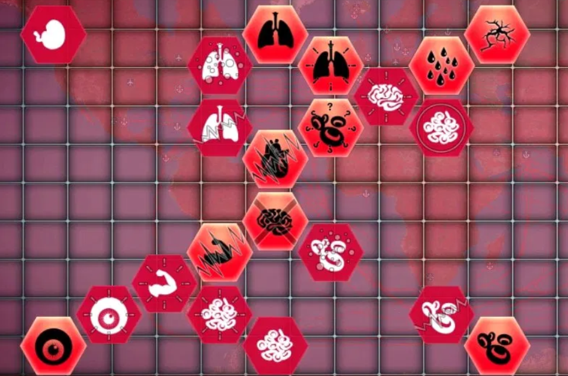

## Entrega 3 - ORM HIBERNATE

## De vuelta con los científicos del laboratorio

Triunfantes y llenos de algarabía, luego de haber cumplido todos y cada uno de los minuciosos requerimientos que los científicos les habían impuesto, vuelven al laboratorio donde se encuentran con una situación tanto particular.

Caos y desorden por todos lados, científicos corriendo de un lado a otro llevando torres de papelerio de aquí allá; Profesionales en batas blancas desplomados sobre sus escritorios por el cansancio; Vasitos de plástico tirados en el piso, aun mojados con café.

Un científico con los ojos algo cansados se les acerca para bienvenirlos, y comentarles que desde la última entrega, han estado trabajando sin parar con la simulación y realizando descubrimientos realmente importantes.

Sin dejarlos ni siquiera contestar y con un movimiento brusco, los empuja hacia la sala de proyecciones, donde el científico si bien cansado, comienza a compartir su conocimiento de forma muy entusiasmada. Esto para ustedes solo significa una cosa.... más requerimientos.

## Funcionalidad

## Mutaciones

  

Ya en la sala de proyectores, el científico profundiza contándonos más sobre las especies, las cuales nos interesan por su capacidad de mutar y potenciarse.
 
Una mutación es una nueva habilidad que incrementa el valor numérico de uno de los atributos de la especie.
 
Una especie puede mutar utilizando ADN. Cada mutación tiene un número de puntos de ADN que la especie tiene que gastar para conseguirla.
 
Así mismo, cada nueva mutación permite desbloquear nuevas mutaciones que la especie potencialmente podría desarrollar, de tener suficiente ADN para adquirirlas.
 
El científico que les está compartiendo esta información se toma unos segundos para comentarles que es importante que tengan en cuenta que una mutación particular puede tener como requerimiento una combinación de varias mutaciones previas.

## ADN
Una especie obtendra 1 de ADN cada 5 personas infectadas

## DTO

Una vez terminadas las charlas con los científicos, presto, vuelven a su trabajo de investigación dejándolos parados en la sala de proyecciones. Mientras se preguntaban si se podían retirar ya o no, ven como el líder técnico se acerca y les comenta sobre grandes avances que estuvo realizando el equipo de Frontend los cuales ya poseen una interfaz semi-funcional lista como prototipo, y nos comenta que nos van a presentar unos nuevos DTOs (Data Transfer Object) para que implementemos.
Deberemos implementar: EspecieLiderDTO, ReporteDeContagiosDTO y modificar EspecieDTO para que haga uso de las mutaciones.

## Servicios

Se pide que se modifique el siguiente servicio, agregandole el metodo listado.

### EspecieService

- `esPandemia(especieId: Long): Boolean` Devuelve true si la especie se encuentra presente más de la mitad de todas las locaciones disponibles

Se pide que implementen los siguientes servicios los cuales serán consumidos por el frontend de la aplicación.

### MutacionService

- `Create Read  de Mutaciones`

- `mutar(especieId: Long, mutacionId: Long)` Muta la especie. Recordar que para mutar, la especie debe cumplir con los requerimientos de la mutación.

### EstadisticaService

- `especieLider(): Especie` retorna la especie que haya infectado a más humanos

- `lideres(): List<Espceie>` retorna las diez primeras especies que hayan infecatado la mayor cantidad total de vectores humanos y animales combinados en orden descendente.

- `reporteDeContagios(nombreDeLaUbicacion: String): ReporteDeContagios` Dada una ubicacion, debera retornar un objeto reporte que contenga
    - La cantidad de vectores presentes.
    - Cantidad de vectores infectados.
    - Nombre de la especie que esta infectando a mas vectores.

### Se pide:

- Que provean implementaciones para las interfaces descriptas anteriormente.

- Creen test que prueben todas las funcionalidades pedidas, con casos favorables y desfavorables.

- Provean la implementacion y modificaciones a los DTO mencionados.
