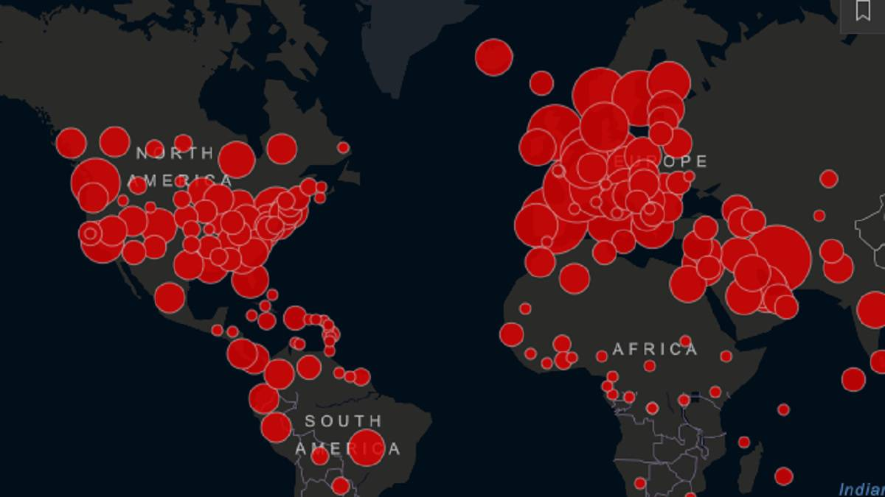
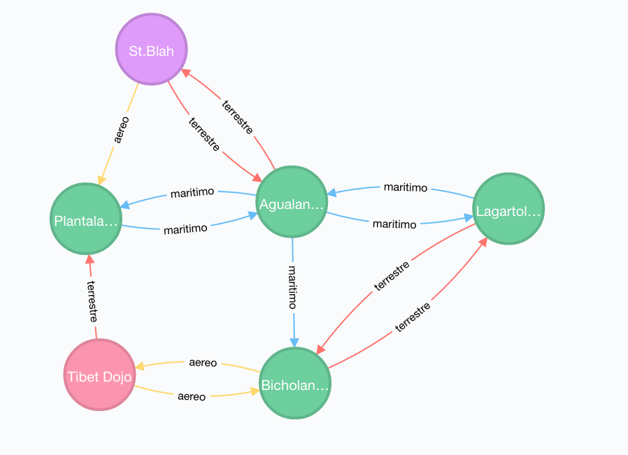

Al equipo le costó, pero llegó a la última entrega. Pasaron por un duro proceso: Fueron al laboratorio, obtuvieron sus requerimientos, pasaron incontables horas de arduo trabajo peleando con el código y resolviendo malentendidos con los product owners, pero ya todo eso terminó. La simulación que les habian encargado esta terminada.
Se abrazan con sus compañeros y se preparan para salir a comer asado para festejar un trabajo bien hecho,  cuando Zas! El jefe de la empresa donde trabajan abre la puerta y los mira severamente… son otra vez los del laboratorio... y vienen con más requerimientos.

## Entrega 4 - NoSQL - Neo4J

  

Como bien habíamos aprendido, en nuestro sistema existen las ubicaciones. Todo vector tiene actualmente una ubicación y es posible que los vectores se muevan de ubicación en ubicación.
Los del laboratorio sin embargo, les dicen que la representación actual del concepto de ubicaciones se queda corto, y necesitan ampliar un poco su definición y comportamiento.

### Movimiento

Es poco real que los vectores se esten moviendo de una ubicación a otra ubicación sin restricción, casi como si pudieran teletransportarse.  Para hacernos cargo de esta irregularidad, se nos confía el modelado más real de ubicaciones.

En un principio, las ubicaciones deberían estar conectadas entre sí por medio de un camino, y un vector que necesite ser movido sólo debería poder moverse a una ubicación conectada a la ubicación donde está.

Los caminos se categorizan en tres tipos:

- Caminos terrestres : Que pueden ser atravesados por todos los tipos de vectores
- Caminos marítimos: Que pueden ser atravesados por humanos y animales
- Caminos aéreos: Que solo pueden ser atravesados por insectos y animales.

  

## Servicios

Se deberan realizar las siguientes modificaciones al `UbicacionService`:

- El mensaje `mover`  deberá ser reimplementado de forma de que:
  - El vector intente llegar a la ubicación dada en la menor cantidad de movimientos.
  - Arroje una excepción `UbicacionNoAlcanzable` si no es posible llegar desde la actual ubicación del vector a la nueva por medio de un camino. 
    
  Hay que tener en cuenta que o todos los tipos de vectores pueden moverse por los mismos tipos de caminos.

- El mensaje `crearUbicacion` deberá ser re-implementado de tal forma que cree la ubicación tanto en hibernate como en Neo4j.

- Se deberá implementar el metodo `conectar(ubicacion1:Long, ubicacion2:Long, tipoCamino:String)` que conecte dos ubicaciones (se asumen preexistentes) por medio de un tipo de camino.

- Se deberá implementar el metodo `conectados(ubicacionId:Long): List<Ubicacion>` que dado el id de una ubicación, retorne todos las ubicaciones conectadas al a ubicación dada por cualquier tipo de camino.

- Finalmente, para poder analizar la capacidad de expansion de un patógeno; se debera crear un mensaje `capacidadDeExpansion(vectorId: Long, nombreDeUbicacion:String, movimientos:Int): Int` que dado un vector, retorna la cantidad de diferentes ubicaciones a las que podría moverse el Vector dada una cierta cantidad de movimientos.

### Se pide:
- El objetivo de esta entrega es implementar los requerimientos utilizando una base de datos orientada a grafos.
- Creen test unitarios para cada unidad de código entregada que prueben todas las funcionalidades pedidas, con casos favorables y desfavorables.

### Recuerden que:
- Los caminos no son bidireccionales. Todo camino tiene una dirección. Los caminos bidireccionales serán sencillamente modelados como dos caminos en direcciones opuestas.
- Encapsulen el acceso a la base de datos detrás de un DAO.